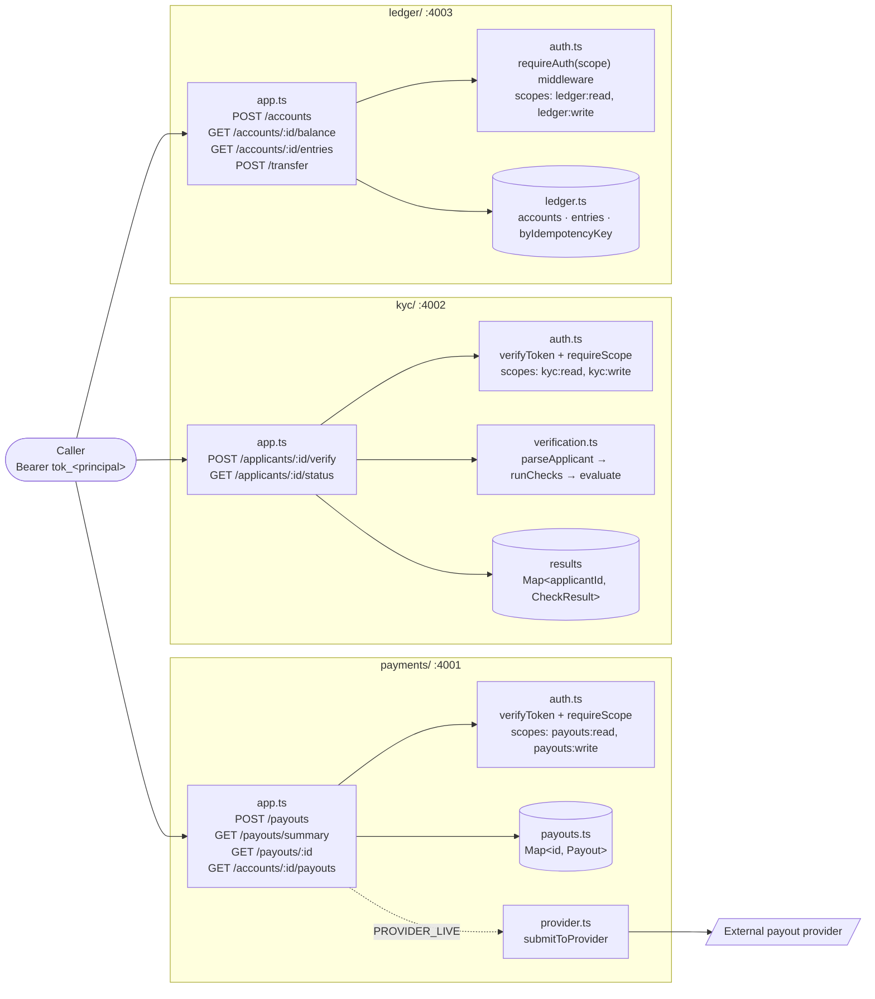
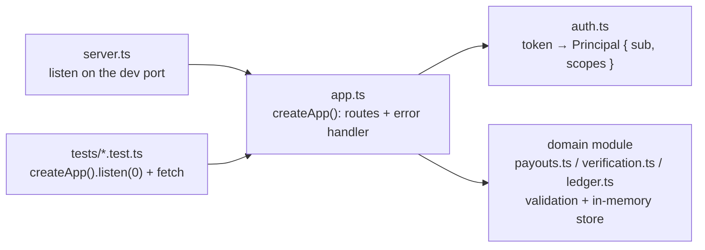

# ccw-advanced-claude-code-lab

Three small money-movement services: payout creation and lookup, applicant verification, and a
shared ledger. TypeScript on Node 20+, npm workspaces, Express 5, Vitest, and `tsx` — no build
step. Each service owns its `src/`, `tests/`, and `package.json` dependencies; nothing is shared
between services on purpose.

## Services

| Folder      | Purpose                        | Dev port | Routes |
|-------------|---------------------------------|----------|--------|
| `payments/` | Payout creation and lookup     | 4001     | `GET /health`, `POST /payouts`, `GET /payouts/summary`, `GET /payouts/:id`, `GET /accounts/:accountId/payouts` |
| `kyc/`      | Applicant verification rules   | 4002     | `GET /health`, `POST /applicants/:id/verify`, `GET /applicants/:id/status` |
| `ledger/`   | Accounts, balances, transfers  | 4003     | `GET /health`, `POST /accounts`, `GET /accounts/:id/balance`, `GET /accounts/:id/entries`, `POST /transfer` |

Auth is a bearer token: `payments` and `kyc` check it per-route via `verifyToken`; `ledger`
checks it through its `requireAuth` middleware.

## Architecture

Three independent Express apps, one per folder, each with its own in-memory store, its own
copy of the token check, and its own tests. No service calls another — a caller talks to each
one directly. The only outbound call is `payments` → the payout provider, and only when
`PROVIDER_LIVE` is on.



Every service follows the same file layout, so one agent can own one folder without reading the
others:



Principals are fixed per service (`tok_ops`, `tok_analyst` · `tok_onboarding`, `tok_support` ·
`tok_treasury`, `tok_reporting`); amounts are integers in cents; a transfer carries an
`idempotencyKey` so a retry cannot move money twice. The conventions behind those choices live in
`.claude/skills/money-movement-conventions/SKILL.md`.

## Getting started

Requires Node 20+.

```bash
npm install                 # once, at the root
npm test                    # all three services
npm test -w kyc             # one service (also: npm run test:kyc)
npm run dev:payments        # start one service
npm run test:stable         # excludes one test that's flaky by design
npm run check               # repo self-check
```

## Repo layout

- `payments/`, `kyc/`, `ledger/` — the three services, each with its own `src/`, `tests/`, and dependencies
- `.claude/` — skills, agents, and hooks Claude Code uses in this repo
- `evals/` — an eval kit for one of the skills
- `issues/`, `grading/` — three issue files (one per service) and the hidden tests that grade a fix
- `tools/` — a token-usage ledger, a status line, a scorecard, and a repo self-check
- `build-it/`, `solutions/` — a bonus build track and its finished reference

## This repo doubles as a workshop

This repo is also the reference repo for the Advanced Claude Code workshop. A few things are
wrong on purpose — one test is flaky by design — so an attendee can practice finding and fixing
real defects with Claude Code. Read [CASE.md](CASE.md) for the story and
[WORKSHOP.md](WORKSHOP.md) for the full workshop guide.

`CLAUDE.md` holds the rules Claude Code reads at every session start.
